# Godot 3D Cursor Plugin

This plugin implements a *3D Cursor* in the Godot Engine, inspired by Blender’s 3D cursor functionality.
It provides an intuitive and precise way to place and position nodes within a 3D scene, improving the overall workflow for 3D level design.

## Features
- Intuitive *3D Cursor* placement directly in the editor
- Precise node placement for all `Node3D`-based nodes
- Precise placement for points of a `Path3D`s curve
- Multiple cursor actions via *Pie Menu*, *Command Palette* and *Settings Dock*
- Customizable cursor appearance and behavior
- Semantic, customizable color coding for 3D Cursor ID labels to improve visual clarity.
- Multiple independent *3D Cursor* instances per scene
- Create `Path3D` nodes along the alphabetically sorted list of *3D Cursor* instances
- Editor-only functionality (no runtime impact)

## 3D Cursor
- **3D Cursor Placement**: Use `Shift + Right Click` to place the *3D Cursor* in a 3D scene. The cursor can be placed on `CSGShape3D` nodes as well as any mesh-based nodes. Compatible with Godot’s standard editor gizmos.
- **Node Placement at Cursor**: New nodes inheriting from `Node3D` are automatically positioned at the active cursor's location instead of the scene or parent node's origin. If the active cursor is hidden or disabled via an action, this functionality is disabled.
- **Additional Commands**: Multiple cursor actions are accessible through the *Pie Menu* (`Shift + S`), the *Command Palette* (`Ctrl + Shift + P`) and the *Settings Dock*.
- **Customizable Appearance**:
	- By default, two labels are displayed on every cursor, with options to scale them together with the cursor or keep them fixed.
	- The cursor itself is scalable to fit different scene requirements.
	- Settings are stored per *3D Cursor* instance and saved internally.
- **Scene Compatibility**: The *3D Cursor* can be placed independently across multiple scenes without limitations. If the plugin is disabled, opening a scene containing *3D Cursor* instances will cause them to free themselves.
- **Editor Exclusive**: *3D Cursor* instances are editor-only and will not be displayed in-game.
- **Semantic Coloring of 3D Cursor IDs**:
	- **Inactive cursors** are displayed in yellow.
	- **The active cursor** is highlighted in orange.
	- **Selected cursors** (including the active one, if applicable) are shown in light blue.
	- The colors can be customized via the settings dock under **General Settings**.

> [!Note]
> Color changes are not session persistent.

## Cursor Actions

| **Action**                             | **Description**                                                                                                                                                                                                                                                                 | **Accessible through**                         | **Undo** |
| -------------------------------------- | ------------------------------------------------------------------------------------------------------------------------------------------------------------------------------------------------------------------------------------------------------------------------------- | ---------------------------------------------- | :------: |
| **3D Cursor to Origin**                | Resets the active cursor's position to the scene origin.  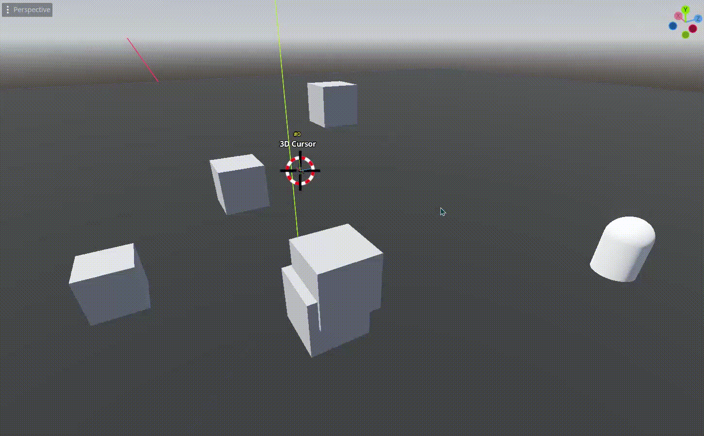                                                                                                                                                             | *Pie Menu*, *Command Palette*, *Settings Dock* |    ✅     |
| **3D Cursor to Selected Object(s)**    | Moves the active cursor to the position of a selected object or to the average position if multiple objects are selected.  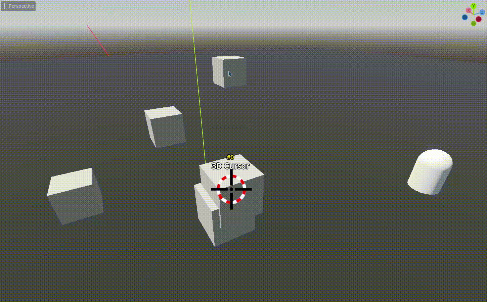   | *Pie Menu*, *Command Palette*, *Settings Dock* |    ✅     |
| **Selected Object to 3D Cursor**       | Moves the selected object to the position of the active cursor.  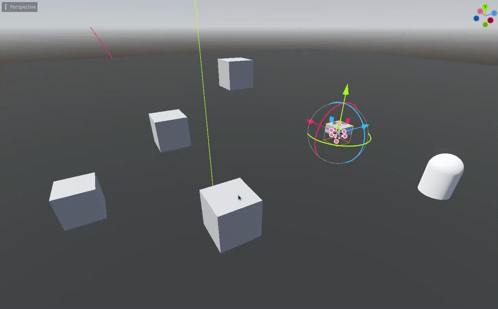                                                                                                                                           | *Pie Menu*, *Command Palette*, *Settings Dock* |    ✅     |
| **Disable / Enable 3D Cursor**         | Either hides the active cursor and disables its functionality or shows it and enables its functionality.                                                                                                                                                                        | *Pie Menu*, *Command Palette*, *Settings Dock* |    ❌     |
| **Remove Active 3D Cursor from Scene** | Removes the active cursor from the scene and frees it.                                                                                                                                                                                                                          | *Pie Menu*, *Command Palette*, *Settings Dock* |    ❌     |
| **Remove All 3D Cursors from Scene**   | Removes all cursors from the scene.                                                                                                                                                                                                                                             | *Pie Menu*, *Command Palette*, *Settings Dock* |    ❌     |
| **Move Active 3D Cursor to ...**       | Moves the active cursor to either a selected `Node3D` or to coordinates extracted from dragged object properties.                                                                                                                                                               | *Command Palette*, *Settings Dock*             |    ✅     |
| **Create Path3D From Cursors**         | Creates a new `Path3D` node as a child of a selected `Node3D`. Its curve is built from all 3D Cursor positions in the active scene, ordered alphabetically.  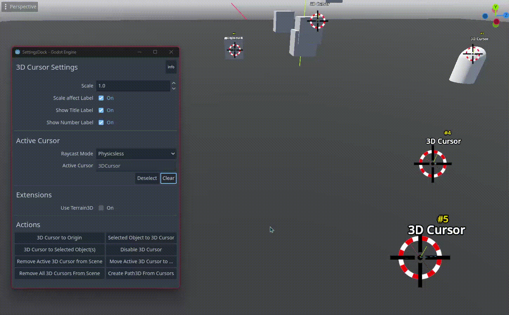                                       | *Command Palette*, *Settings Dock*             |    ❌     |

## Pie Menu
The *Pie Menu* provides quick access to common *3D Cursor* actions directly within the editor.

- Access the *Pie Menu* via `Shift + S` when a *3D Cursor* instance is present in the current scene and assigned as the active cursor.
- Either hold `Shift + S`, hover over the desired action and release the shortcut to invoke it, or simply click the desired action.

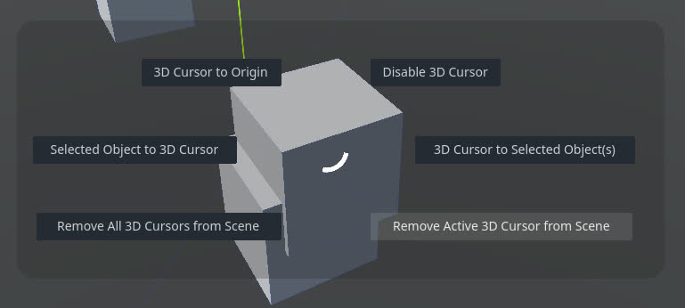

## Settings Dock

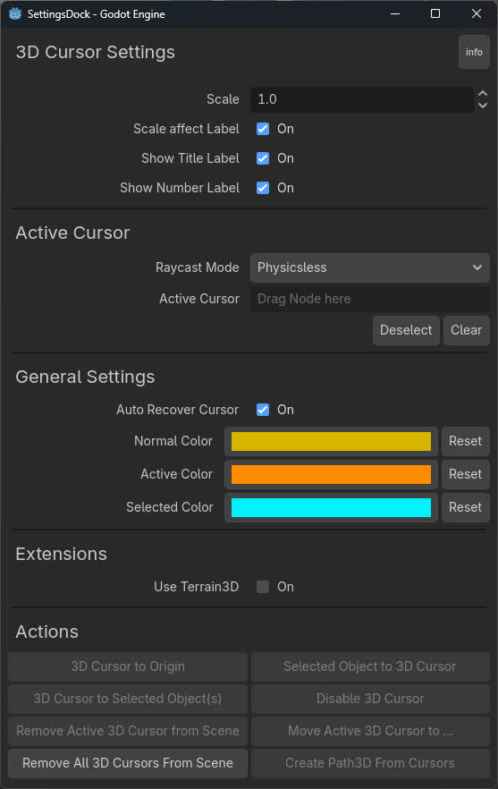

### Raycast Mode
- **Physicsless**: Does not require collision shapes to calculate the mouse click position, allowing physics to run on another thread. Compatible with **Terrain3D** by *TokisanGames*.
- **Physics** *(Legacy)*: Requires collision shapes to calculate the mouse click position. Physics must not run on another thread. Partially compatible with **Terrain3D** by *TokisanGames* (see issue [#3]).

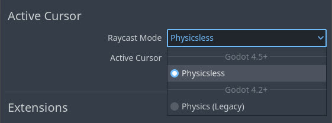

### Active Cursor
- The active cursor is always the most recently created cursor unless cleared manually or removed.
- Clicking the active cursor field in the *Settings Dock* or dragging a *3D Cursor* instance onto it will set a new active cursor.
- `Left Click` selects the active cursor in both the scene tree and the editor.
- `Double Left Click` turns the camera towards the active cursor.
- `Ctrl + Left Click` selects the active cursor, turns the camera towards it and zooms in.
- `Alt + Left Click` opens a node selector window to choose a *3D Cursor* instance as the new active cursor.

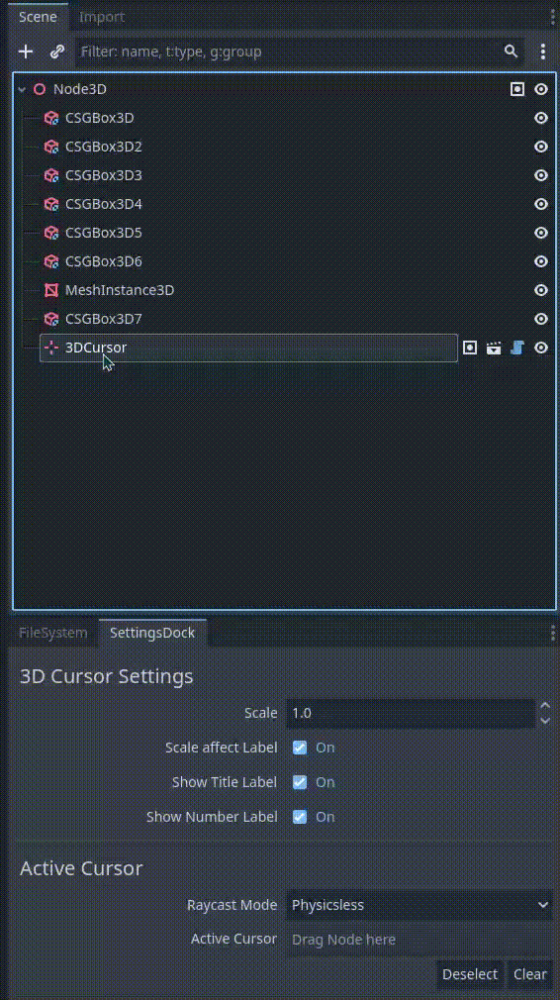

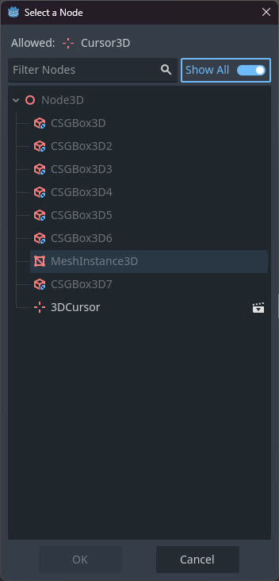

### Terrain3D Compatibility
To work with **Terrain3D** by *TokisanGames*, enable the extension in the *Settings Dock* and add the required group to each **Terrain3D** instance in the scene using the provided button.

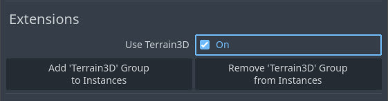

### Action Buttons
- All cursor actions are also accessible via dedicated buttons in the *Settings Dock*.
- The **Move Active 3D Cursor to ...** button is special:
	- It can open a node selector window to choose any `Node3D`
	- Or accept dragged nodes or object properties

Allowed object property types:
- `PackedVector2Array`, `PackedVector3Array`, `PackedVector4Array`
	- Only the first element is used
	- Default mapping: `x → x`, `y → y`, `0 → z`
	- Hold `Shift` to use: `x → x`, `0 → y`, `y → z`
- `Transform2D`, `Transform3D`
- `Vector2`, `Vector2i`
	- Default mapping: `x → x`, `y → y`, `0 → z`
	- Hold `Shift` to use: `x → x`, `0 → y`, `y → z`
- `Vector3`, `Vector3i`
	- Mapping: `x → x`, `y → y`, `z → z`
- `Vector4`, `Vector4i`
	- Mapping: `x → x`, `y → y`, `z → z` (`w` is discarded)
- Specially structured `Dictionary`
	- Must contain keys `x`, `y` and `z` (case-insensitive)
	- Values must be of type `float` or `int`

Dragging a valid node or object property onto the button reveals the extracted target position below it.

### Path3D Compatibility
When a `Path3D` node is selected in the scene tree, adding a new point to its curve will place the point at the position of the active 3D Cursor. This requires exactly one selected node and an active 3D Cursor.

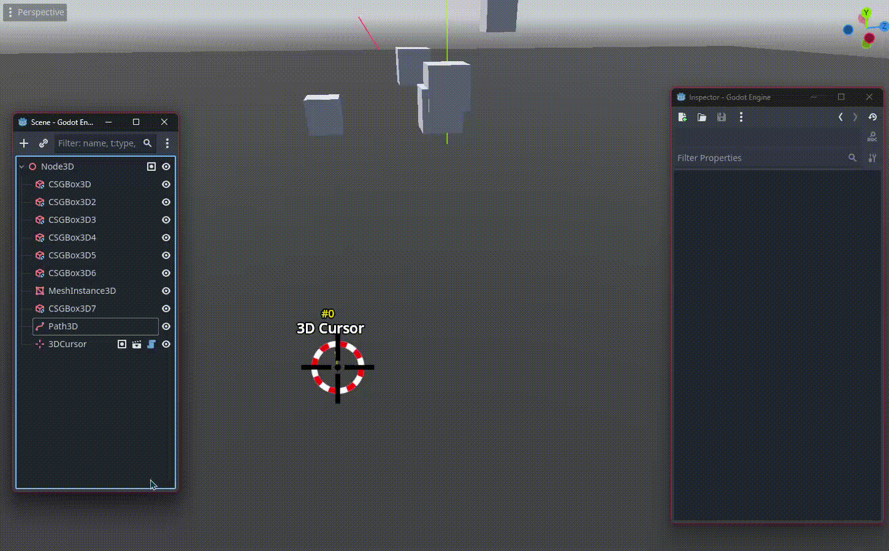

When a single `Path3D` node is selected, additional points can be added directly to its curve by placing extra cursors using `Shift + Ctrl + Right Click`. New points are always appended to the end of the curve.

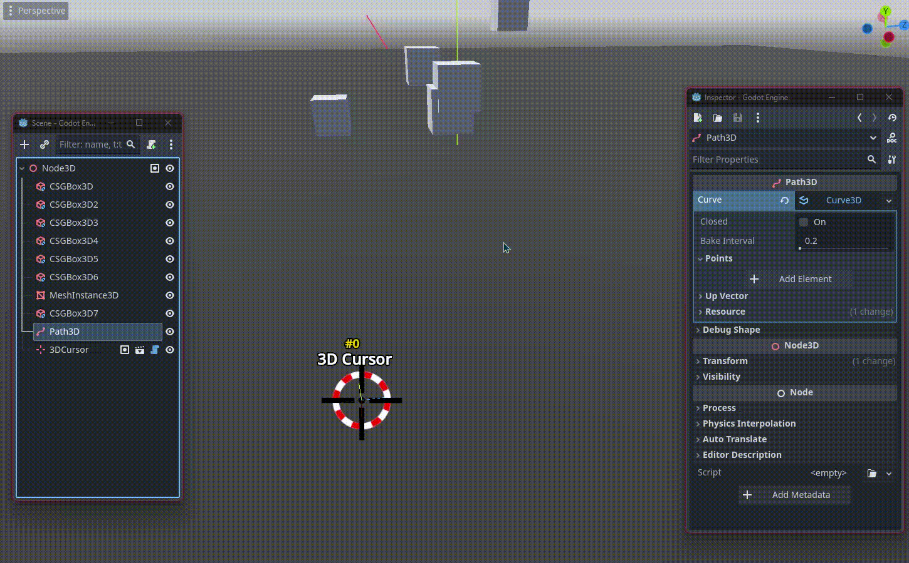

## Quick Start
- Enable the plugin
- Within a 3D scene, use `Shift + Right Click` on any mesh-based node or node inheriting from `CSGShape3D` to place a *3D Cursor*
- Use `Shift + S` to open the *Pie Menu* and access *3D Cursor* actions
- Use `Ctrl + Shift + Right Click` to place additional *3D Cursors*
- Assign different *3D Cursors* as active by dragging them into the active cursor field in the *Settings Dock*

## Known Issues
- After using `Ctrl + Left Click` on the active cursor field (selecting the cursor, rotating the camera and zooming in),
  the editor may keep the previous navigation distance internally if the camera was zoomed out beforehand.
  This can result in an excessively high panning speed.

  **Workaround:** Press `F` to reset the editor focus and restore the expected navigation behavior.
- A more robust solution is being investigated, but this behavior is currently caused by editor-internal state handling.

### Plugin Compatibility
If you are developing a Godot plugin or addon and believe compatibility with this plugin would be useful, feel free to reach out.
Compatibility and integration are handled on this plugin’s side where possible.

## Requirements
- **Godot 4.2** or newer
- 3D projects

## Installation

### Godot Asset Library
1. Open the *Asset Library* in the Godot editor
2. Search for "**Godot 3D Cursor**" by *Marco-*
3. Download and enable the plugin in Project Settings → Plugins

### Manual Installation
1. Download or clone this repository
2. Copy the `addons` folder into your project
3. Enable the plugin in Project Settings → Plugins

## Feedback
Feedback, bug reports, and contributions are very welcome.
Feel free to open an issue or pull request.

## License
This plugin is open-source and licensed under the **ISC License**.
See [LICENSE](LICENSE) for more details.

---

 

If you find this plugin useful and would like to support my work, you can do so on Ko-fi:

