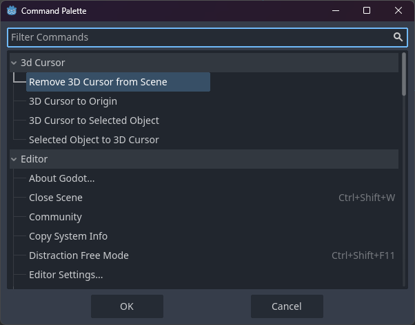

# 3D Cursor Plugin for Godot Engine

This plugin implements a 3D cursor in the Godot Engine, inspired by the 3D cursor functionality in Blender. It provides an intuitive way to place and position new nodes within a 3D scene, along with additional positioning tools.

## Features

- **3D Cursor Placement**: Use `Shift + Right Click` to place the 3D cursor in a 3D scene. The cursor appears only when clicking on a surface with a collider, ensuring accurate placement on interactable objects.
- **Node Placement at Cursor**: New nodes inheriting from `Node3D` are automatically positioned at the cursor’s location instead of the scene or parent node’s origin. If the cursor is hidden, this functionality is disabled.
- **Cursor Persistence**: If the cursor is deleted, it can be restored by pressing `Shift + Right Click` again. The cursor can also be manually adjusted using Godot's standard gizmos.
- **Additional Commands in the Command Palette**:
  - **3D Cursor to Origin**: Resets the cursor's position to the scene origin.
  - **3D Cursor to Selected Object**: Moves the cursor to the position of a selected object or to the average position if multiple objects are selected.
- **Customizable Appearance**:
  - An optional label can be displayed with the cursor, with settings to scale it along with the cursor or keep it fixed.
  - The cursor itself is scalable to fit different scene requirements.
- **Scene Compatibility**: The cursor remains functional across different scenes. When placed in a new scene, it will be automatically removed from the previous one.

## Activation Instructions

**Note:** Due to certain engine limitations, you must switch to a tab other than the 3D view (e.g., 2D, Script, or AssetLib) and then back to the 3D view once after enabling the plugin or upon engine startup to ensure full functionality.

## Usage

- **Placing the Cursor**: Press `Shift + Right Click` within a 3D scene to place the cursor on a collider surface. The cursor appears in the Node Tree and can be toggled visible or hidden.
- **Node Placement**: When adding a new `Node3D`, it will be positioned at the cursor’s location if the cursor is visible.
- **Moving the Cursor**: Use the following commands from the Command Palette (Ctrl + Shift + P):
  - **3D Cursor to Origin**: Resets the cursor to the origin of the scene.
  - **3D Cursor to Selected Object(s)**: Aligns the cursor with the selected object(s).
  - **Selected Object to 3D Cursor**: Aligns the selected object with the cursor.
  - **Remove 3D Cursor from Scene**: Removes the cursor from the scene and freeing it.
- **New in v1.2.0:**
  - **The Pie Menu**: This Pie Menu provides the same functionality as the command palette and is easier to reach. (Shift + S)
  - **Undo and Redo**: Undo/Redo works as expected.
- **Customizing the Cursor**: Adjust the cursor’s size and enable or disable the optional label via the Inspector. You can also configure the label to either scale with the cursor or remain fixed.

## Version 1.2: Pie Menu and Undo-Redo Update

This update introduces a **Pie Menu** similar to Blender's, accessible via `Shift + S`. This menu provides quicker access to commands also found in the Command Palette, allowing for a faster workflow.

Additionally, **Undo and Redo** functionality has been added, allowing most cursor actions to be undone/redone. The exception is the `Remove 3D Cursor from Scene` command, as it frees the cursor object itself and thus cannot be undone.

## Installation

1. Download or clone the repository into your Godot project’s `addons` folder or download the plugin via the AssetLib in the engine.
2. Enable the 3D Cursor Plugin in **Project > Project Settings > Plugins**.

---

https://github.com/user-attachments/assets/6b1ddf33-e0a3-4c5e-a93a-4a8efd5c4bda

https://github.com/user-attachments/assets/36245057-8e32-407a-a68a-3c64bb359ad7

https://github.com/user-attachments/assets/03a14673-6d34-4e10-a532-e245e8ee1697

https://github.com/user-attachments/assets/791e785b-c6b1-42bc-8d98-925acd4d239c

https://github.com/user-attachments/assets/58bc277c-64dc-4da4-ad82-67fe5f066db5

## Feedback and Contributions

I welcome feedback, bug reports, and contributions to improve the 3D Cursor Plugin and ensure it meets the needs of the Godot community. 

## License

This plugin is open-source and licensed under the MIT License. See the LICENSE file for more details.
